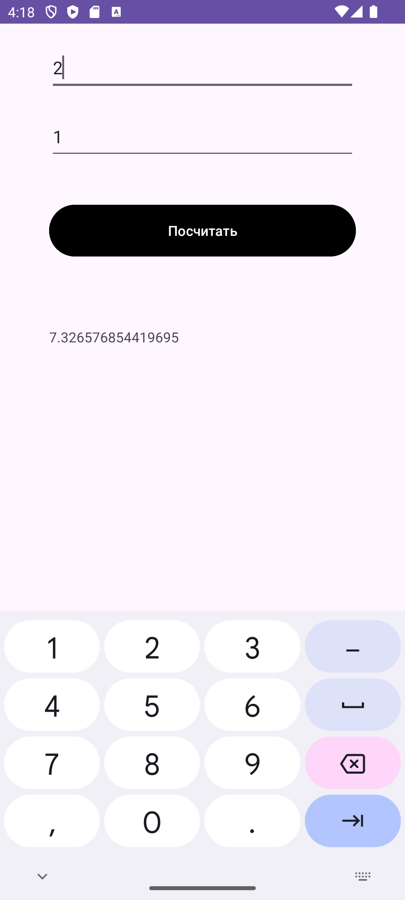

<h1>Company Generator</h1>

<h2>Приложение реализует генерацию рандомного числа, 
логнормальному распределению. </h2>

На вход подаются две величины - μ и σ². 

Приложение содржит два поля ввода, кнопку генерации числа и поле вывода. 

В проекте настроены:. 

- Unit-тесты
- UI-тесты
- GitHub Actions
- 

<h3>Скриншоты</h3>

